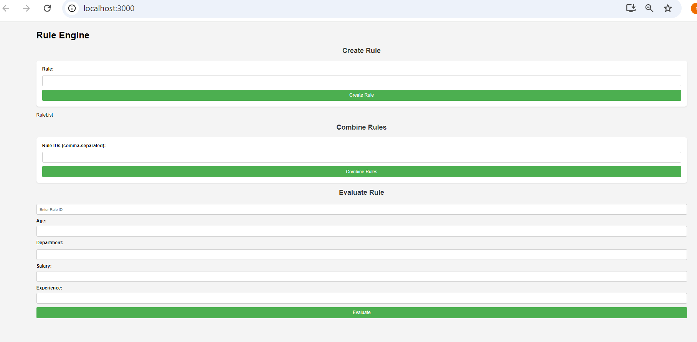

# Rule Engine Application

## Overview

    This project is a Rule Engine Application consisting of a backend API built with Express and a frontend developed with React. The application allows users to create, combine, and evaluate rules based on various attributes.

####    1.Create Rule:

    1.Users can input and create new rules using a rule string that represents conditions.
    2.These rules are translated into an Abstract Syntax Tree (AST) for structured representation and processing.

#### 2.Combine Rules:

    1.Combines multiple rules into a single composite rule.
    2.Multiple rules can be combined into a single composite rule using logical operators like AND/OR.
    3.The combination also uses the AST structure, enabling complex rule creation.
#### 3.Evaluate Rule:

    1.Evaluates rules against user-provided attributes and displays the results.
    2.The evaluation process uses the AST structure to determine the outcome of the rule based on the input
    3.The rules can be evaluated against specific user attributes (like age, income, etc.).
## Objective

The primary goal of this project is to develop a simple 3-tier rule engine application that determines user eligibility based on attributes such as age, department, income, and spend. The system uses an Abstract Syntax Tree (AST) to represent conditional rules, allowing for dynamic creation, combination, and modification of these rules.
## Setup

### Prerequisites
    1.Node.js (v14 or later)
    2.npm (v6 or later)
### Backend Setup

#### 1.Navigate to the Backend Directory:

    cd backend
    npm install
####  2.Configure the Mongo Database:
Create a new MongoDB database and replace the uri in app.js

    const uri = '<YOUR_MONGODB_URI>'
####  3.Start the Backend Server:

    node index.js
The server will be running at http://localhost:3000.

### Frontend Setup
#### 1.Navigate to the Frontend Directory:

    cd rule-engine-ui
#### 2.Install Dependencies:

    npm install
#### 3.Start the Frontend Server:

    npm start
The frontend will be running at http://localhost:3000.

## Design Choices

### Backend
    Express: For handling API requests.
    Mongoose: For interacting with MongoDB and  managing data.
    AST (Abstract Syntax Tree): Used to represent and evaluate rules dynamically.
### Frontend
    React: For building the user interface.
    Component Structure: Designed to modularize the UI and make it extendable.

## Testing Instructions

### Create Individual Rules
Test rule creation by sending POST requests to /create with different rule strings.
### Combine Rules
Combine created rules using the /combine endpoint and verify the combined AST.
### Evaluate Rule
Send a POST request to /evaluate with rule ID and user data to check the evaluation logic.
### Example Requests

    POST /create
    {
    "ruleString": "age > 25"
    }

    POST /combine
    {
    "ruleIds": ["<RuleID1>", "<RuleID2>"]
    }

    POST /evaluate
    {
    "ruleId": "<RuleID>",
    "data": { "age": 30, "income": 60000 }
    }  
## Dependencies

- **Node.js :** JavaScript runtime.
- **Express :** Web framework for Node.js.
- **Mongoose :** MongoDB object modeling tool.
- **React :** JavaScript library for building user interfaces.
## Tech Stack

**Client:** React, Javascrip,css

**Server:** Node.js, Express.js,Mongodb

